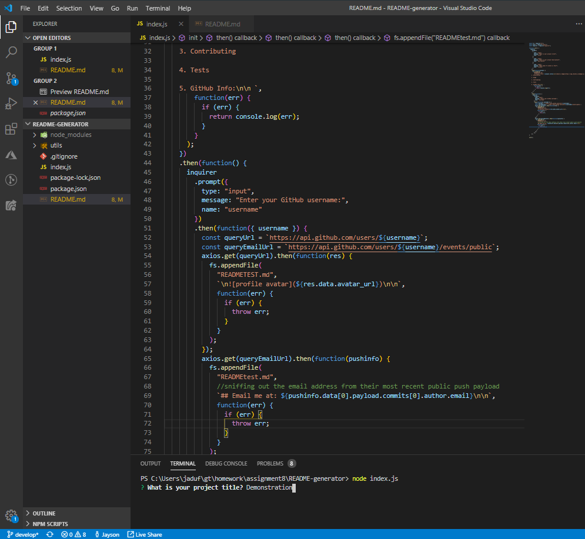
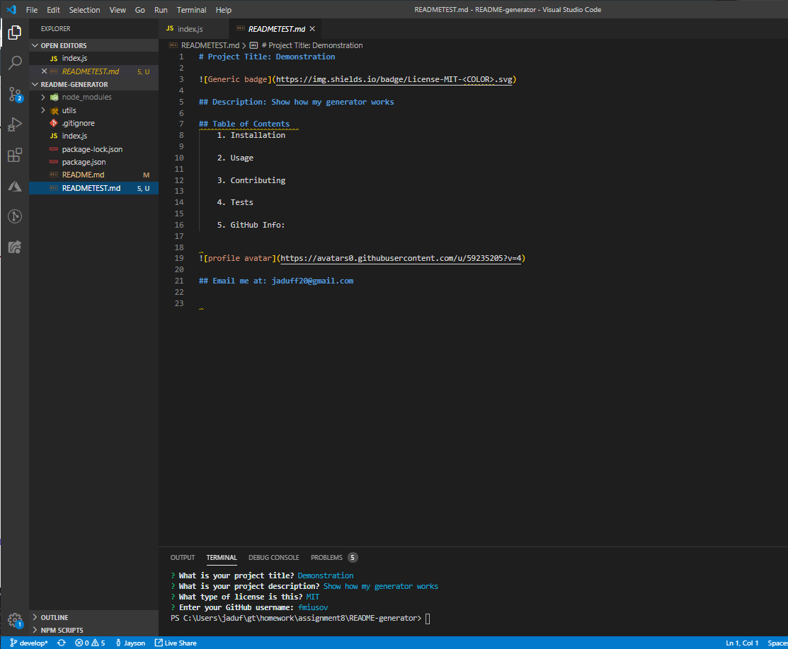

# README-generator

## Description: Uses node.js and console prompts from the inquirer package to generate a README.md

## Table of Contents
1. Installation
    - run npm install 
    - Dependencies:
        * "axios": "^0.19.0",
        * "dotenv": "^8.0.0",
        * "inquirer": "^6.3.1"
  
2. Usage
    - Create READMEs quickly 
3. Gallery

